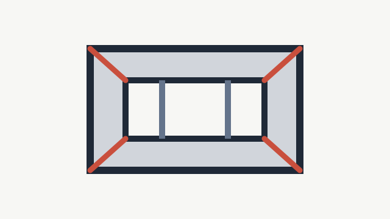

# 铝材型材与壁厚

- ID: `aluminum-profile`
- Tags: 铝材, 型材, 壁厚, 隔热条, 腔体
- Version: 1.0.0
- Updated: not set
- Change note: not set

## Knowledge

门窗铝材常见关注点包括型材壁厚、腔体设计、隔热条、表面喷涂和原生铝材稳定性。售前不要只说越厚越好，要结合窗洞尺寸、楼层风压和开启方式。

## Reply Templates

- 铝材建议不要只看厚度。您家窗户大概多宽多高、楼层高不高、是平开还是推拉？这些会影响型材壁厚、腔体和五金配置。

## Links

- none

## Attachments

- none
