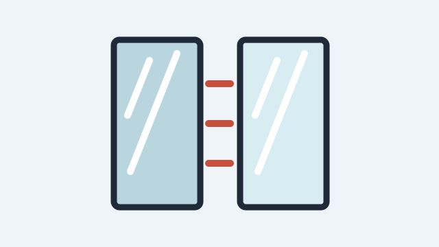

# 玻璃配置

- ID: `glass-package`
- Tags: 玻璃, 中空玻璃, 夹胶玻璃, Low-E, 隔音, 隔热
- Version: 1.1.0
- Updated: 2026-05-02
- Change note: 补充玻璃配置表格和 GitHub 备份素材。

## Knowledge

玻璃配置影响隔音、隔热、安全和采光。常见方案包括双层中空、三玻两腔、夹胶中空、Low-E 中空。临街优先考虑夹胶或不同厚度组合，西晒可考虑 Low-E。

## Reply Templates

- 玻璃要按痛点选：临街噪音重点看夹胶或不同厚度组合；西晒和保温重点看 Low-E 和中空层；如果家里有小孩，高楼层也要把安全性一起考虑。

## Links

- [玻璃配置资料入口](https://openstd.samr.gov.cn/) - 用于人工补充玻璃、安全玻璃、节能玻璃相关标准链接。

## Attachments

- 玻璃配置示意图: `/static/assets/glass.svg` (image) 可替换为真实产品截图或玻璃截面图。

## Tables

- [玻璃配置建议](../tables/glass-package-1.csv)
